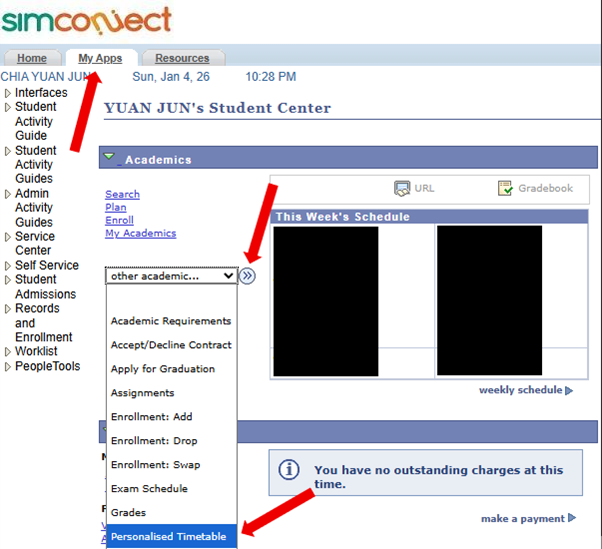
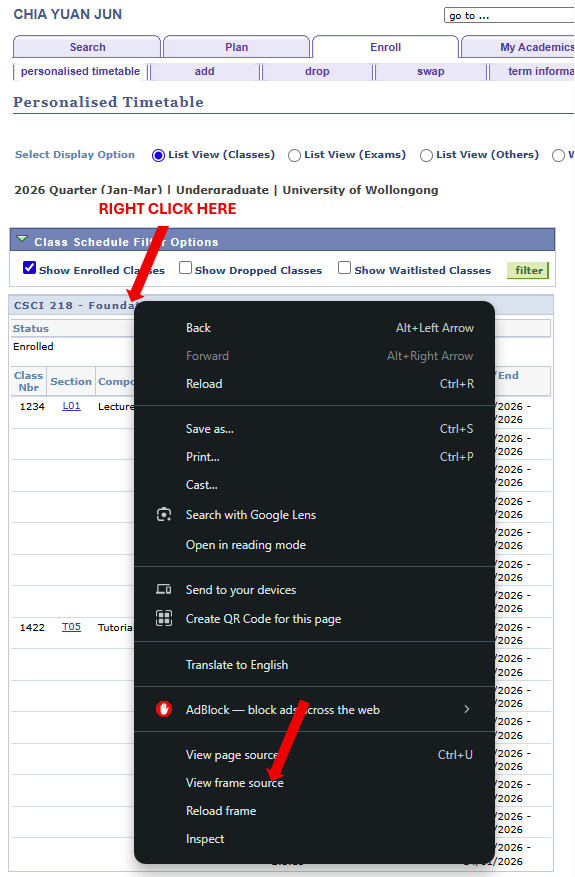
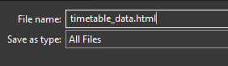

# SIM-TIMETABLE-to-ICS 🎯
SIM-TIMETABLE-to-ICS is a python based tool that extracts timetable data from the SIMConnect portal and converts them into a standards-compliant iCalendar (.ics) file for seamless imports into **Google Calendar, Apple Calendar, and Outlook.**

This script is made for SIM-UOW students, but might work for SIM students of other universities as well if the formatting of the timetable is the same. From what I know the structure should more or less be the same, but if for some reason it does not work, do reach out to me via LinkedIn [here](https://www.linkedin.com/in/chia-yuan-jun/) and i will try my best to help.

---

## 📊 Project Overview
The motivation behind this project came from real, everday frustrations:
- Checking my timetable required repeatedly logging into the SIMConnect website or app, which was troublesome, slow, and the UI/UX was not the best.
- There was no easy way to view my lessons alongside my personal calendar. This made it troublesome when planning my days as it often required me to switch between my personal calendar and the SIM website/app.

This tool aims to solve these issues by allowing timetable data to be imported directly into personal calendars such as **Google Calendar, Apple Calendar, Outlook**, allowing schedules to be easier to view, manage, and cross-check.

---

## ✨ Key Features
- 📍 Timezone-aware events (Asia/Singapore)

- 🔁 Stable event UIDs for safe re-imports (no duplicate events)

- 📝 Clean event summaries, descriptions, and locations

- 📱 Compatible with mobile and desktop calendar clients

- 📆 Standards-compliant iCalendar output (RFC 5545)

---

## 🧠 What This Project Explores
- Practical use of the iCalendar (RFC 5545) specification
- Handling real-world differences between calendar clients (Google vs Apple vs Outlook)
- Robust parsing and data normalization from web-based timetable sources
- Timezone correctness and event identity management
- Turning a personal workflow problem into a reusable automation tool

---

## 🧰 Tech Stack
- **Language**:
```
    - Python 3
```

- **Libraries**:
```
    - BeautifulSoup4    (For HTML parsing and data extraction)
    - icalendar         (For iCalendar (.ics) file generation)
    - datetime          (For date and time parsing and manipulation)
    - pytz              (For timezone handling)
    - os                (For file system operations)
    - re                (For pattern matching with regular expressions) 
```

---

## 📁 Project Structure
```
SIM-TIMETABLE-to-ICS/
├── assets/                 # Folder containing README images
├── extract_timetable.py    # Script to extract course/lesson data from HTML
├── generate_ics.py         # Main script generating .ics file
├── mock_html_test.html     # Example HTML from SIMConnect Website
├── mock_timetable.ics      # Output .ics file with timetable data
├── README.md               # Project documentation
└── requirements.txt        # Python package dependencies
```

---

## ⚠️ Disclaimer

This project is built specifically for SIM timetable data and is intended for personal and educational use.
It is not an official SIM tool and is not affiliated with or endorsed by Singapore Institute of Management.

---

## ▶️ How to Use (Generating .ics file)
1. **Clone the repository**:
    ```bash
    git clone https://github.com/cyuanjun/SIM-TIMETABLE-to-ICS.git
    ```

2. **Change directory**:
    ```bash
    cd SIM-TIMETABLE-to-ICS
    ```

3. **Create/Activate virtual environment (Optional)**:
    
    - #### Windows:
        - Creating virtual environment
        ```bash
        python -m timetable_to_ics_venv
        ```

        - Activating virtual environment
        ```
        timetable_to_ics_venv\Scripts\activate
        ```
    - #### Mac:
        - Creating virtual environment
        ```bash
        python3 -m venv timetable_to_ics_venv
        ```

        - Activating virtual environment
        ```
        source timetable_to_ics_venv/bin/activate
        ```

    - #### Deactivating virtual environment (Windows/Mac)
        - Same for Windows / Mac
        ```bash
        deactivate
        ```

4. **Install necessary libraries from requirements.txt file into virtual environment**:
    ```bash
    pip install -r requirements.txt
    ```
5. **Getting HTML table data**:

    
    - Login to the SIMConnect page and navigate to the `My Apps` section on the top left.
    - Click on the dropdown menu under Academics with `other academic...`, select `Personalised Timetable`, and click the arrow icon beside.
    - You should end up at the timetable page.

    
    - Right click on the timetable table and click on `View frame source`.
    - A page should pop up. Copy everything on that page using `CTRL + A` and `CTRL + C`.

    
    - Paste the contents into your notepad and save it as a .html file (Remember to change the file type to `All files`). You can put any name you want, for simplicity we're using `timetable_data.html`.

6. **Running the script**:
    - Before running, open up **generate_ics.py** and change `FILE_NAME_HTML` to the name u used to store the HTML data in the previous step (Remember it has to end with .html).
    - Also change `FILE_NAME_ICS` to your desired output file name (Remember it has to end with .ics).
    - You can then run the file using:
      
    ```bash
    python generate_ics.py
    ```

    - The `.ics` file should then be generated in your directory.

7. **Importing .ics Files into Calendars**:
    - For all 3 Calendars, I would recommend creating a calendar and importing the .ics file events into that calendar. That way, you would be able to change the colours of the events by group and control the notification settings
    - _(E.g. Google Calendar adds notifications by default, which can be disabled per calendar)._
    - _(Note: You can only create a new calendar in Google Calendar through the browser)_
   
    - I have listed the general steps here, but do note that these could change:
        - **Google Calendar (browser)**: Settings → Import & export → Import
        - **Google Calendar (android)**: Open the `.ics` file.
        - **Outlook (browser)**: Add Calendar → Upload from file
        - **Apple Calendar (macOS)**: File → Import
        - **Apple Calendar (iOS)**: Open the `.ics` file via Files or AirDrop
    - For Apple Calendar, you might want to refer to this reddit page [here](https://www.reddit.com/r/ios/comments/1kwttla/figured_out_an_easy_way_to_import_ics_files_into/), as from what i heard it can be quite finicky.

---

> 🔒 **Privacy Note:** All timetable data and screenshots in this repository are mock examples.  
> They are included for demonstration purposes only and do not represent my real schedule.
